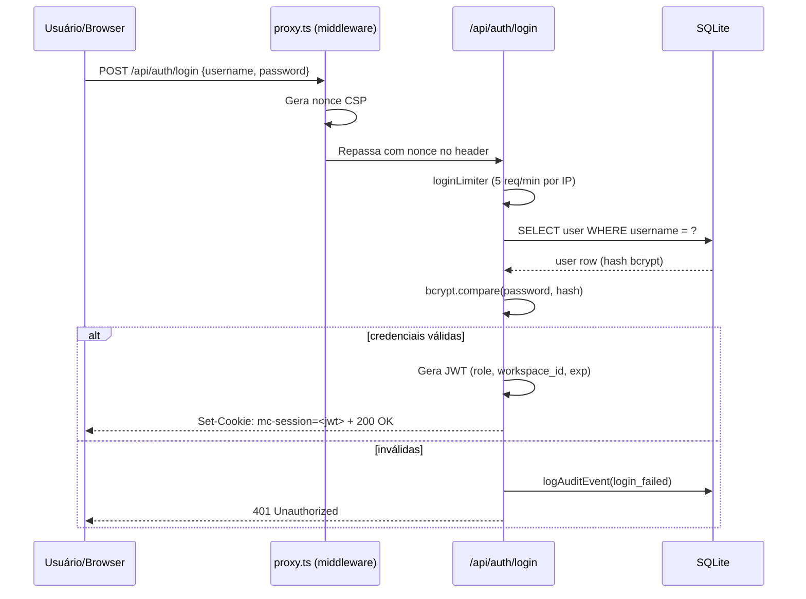
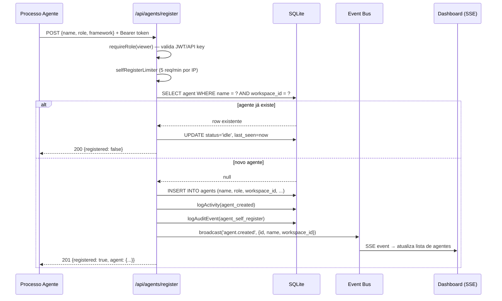
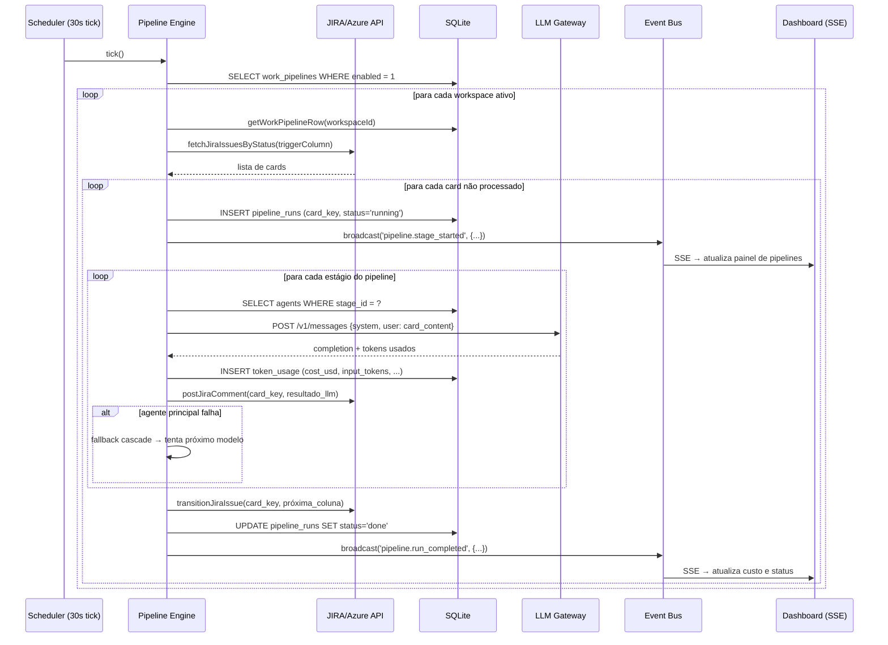
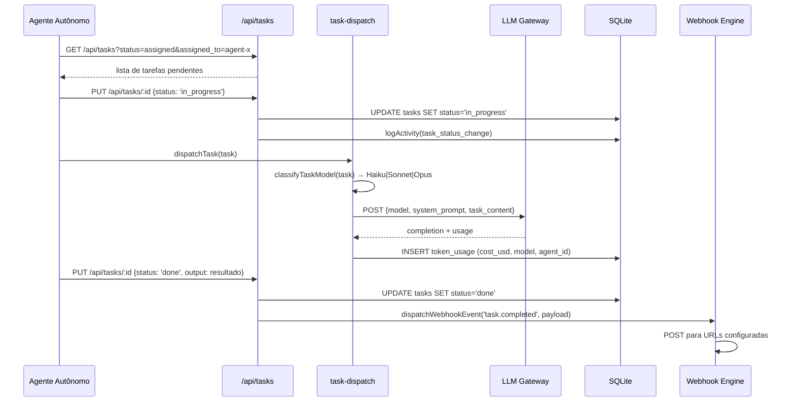
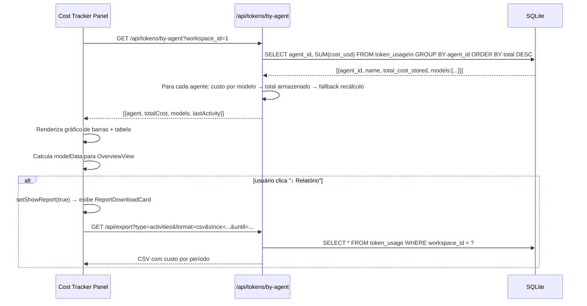
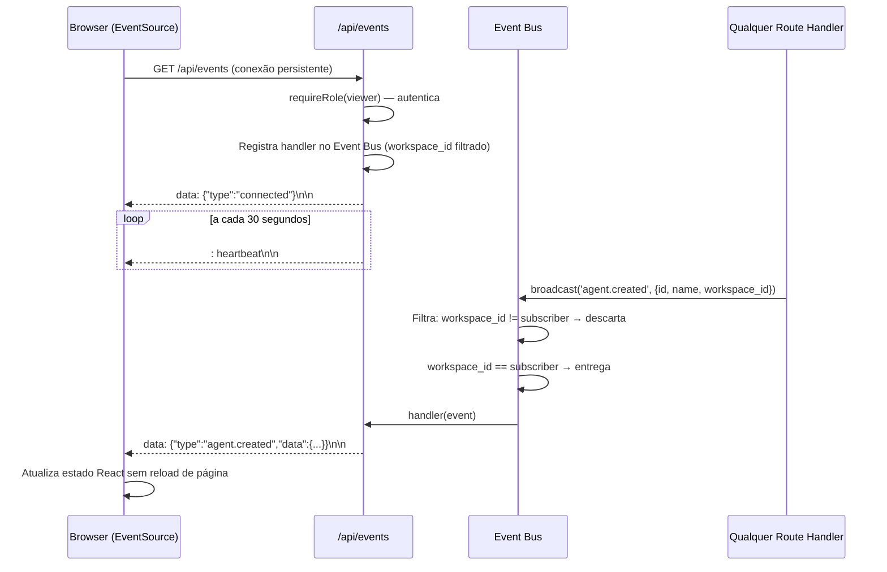

<div align="center">

# Vertex Control Center

**Dashboard de Orquestração de Agentes de IA**

Implante, monitore e orquestre frotas de agentes de IA a partir de uma única interface.\
Conecte seu backlog (JIRA ou Azure DevOps), defina pipelines em múltiplos estágios e deixe os agentes executar cada etapa de forma autônoma — com visibilidade completa de custo, eventos em tempo real e trilha de auditoria.

[](https://nextjs.org/)
[](https://typescriptlang.org/)
[](https://www.sqlite.org/)
[](LICENSE)
[](https://pnpm.io/)

</div>

---

## O que é

Vertex Control Center é um dashboard auto-hospedado para equipes que executam fluxos de trabalho com agentes de IA. Funciona como uma aplicação Next.js standalone com banco de dados SQLite embutido — nenhum serviço externo obrigatório.

**Capacidades principais:**

- **Pipeline engine** — monitora JIRA ou Azure DevOps, roteia cards por pipelines em múltiplos estágios, chama LLMs diretamente, posta resultados e avança os cards automaticamente
- **Gestão de frota de agentes** — registre, monitore, configure e agende agentes autônomos; acompanhe heartbeats, memória e histórico de execução
- **Rastreamento de custo** — visibilidade de custo por agente e por modelo a partir do uso de tokens armazenado; relatórios mensais ou por período exportáveis
- **Eventos em tempo real** — stream SSE entrega mudanças de status de agente, progresso de pipeline e atualizações de tarefa para todos os clientes conectados instantaneamente
- **Multi-workspace** — isolamento completo por tenant; cada workspace tem seus próprios agentes, tarefas, pipelines e dados de custo
- **Segurança hardened** — proteção SSRF, rate limiting com cadeia de proxies confiáveis, CSP com nonces, HSTS, SSE com escopo por workspace e exportação de audit log com escopo por workspace

---

## Arquitetura

```
┌─────────────────────────────────────────────────────────────────┐
│                     Vertex Control Center                        │
│                      Next.js 16 (App Router)                    │
│                                                                  │
│  ┌───────────────────┐        ┌──────────────────────────────┐  │
│  │    Camada de UI   │        │       API Routes (~150)      │  │
│  │                   │        │                              │  │
│  │  React 19         │        │  Auth + RBAC (3 roles)       │  │
│  │  Tailwind CSS 3   │◀──SSE──│  Rate limiting por IP/agente │  │
│  │  Zustand          │        │  Validação de entrada        │  │
│  │  Recharts         │        │  Audit log automático        │  │
│  └─────────┬─────────┘        └──────────────┬───────────────┘  │
│            │                                  │                  │
│            └──────────────┬───────────────────┘                  │
│                           │                                      │
│                  ┌────────▼────────┐                             │
│                  │   Event Bus     │ (in-process, workspace-scoped)
│                  └────────┬────────┘                             │
│                           │                                      │
│             ┌─────────────▼──────────────┐                      │
│             │    SQLite (modo WAL)        │                      │
│             │                            │                      │
│             │  agents       tasks        │                      │
│             │  token_usage  audit_log    │                      │
│             │  pipeline_runs workspaces  │                      │
│             │  webhooks     memory       │                      │
│             └─────────────┬──────────────┘                      │
│                           │                                      │
│             ┌─────────────▼──────────────┐                      │
│             │    Pipeline Engine         │                      │
│             │   (roda no scheduler)      │                      │
│             │                            │                      │
│             │  Monitora JIRA/Azure       │                      │
│             │  Despacha chamadas LLM     │                      │
│             │  Posta comentários         │                      │
│             │  Avança cards              │                      │
│             └─────────────┬──────────────┘                      │
└───────────────────────────┼─────────────────────────────────────┘
                            │
               ┌────────────▼────────────┐
               │     Gateway LLM         │
               │   (configurável)        │
               │  Anthropic · Ollama     │
               └─────────────────────────┘
```

---

## Diagramas de Sequência

### Fluxo de Autenticação



### Fluxo de Registro de Agente



### Fluxo do Pipeline Engine (JIRA/Azure → LLM → Card)



### Fluxo de Execução de Tarefa por Agente



### Fluxo de Rastreamento de Custo



### Fluxo SSE (Server-Sent Events)



---

## Quick Start

**Pré-requisitos:** Node.js ≥ 22, pnpm (`corepack enable`)

```bash
git clone https://github.com/kamilaalves1/vertex-control-center.git
cd vertex-control-center
pnpm install
pnpm dev
```

Acesse [http://localhost:3000](http://localhost:3000) — credenciais padrão: `admin` / `admin`.

> **Primeiro acesso:** `AUTH_SECRET` e `API_KEY` são gerados automaticamente e salvos em `.data/`. Altere a senha padrão imediatamente em **Configurações → Usuários**.

### Build de produção

```bash
pnpm build
pnpm start
# ou modo standalone:
node .next/standalone/server.js
```

### Docker (zero-config)

```bash
docker compose up
```

Overlay de produção hardened (filesystem read-only, rede interna, HSTS, cookies strict):

```bash
docker compose -f docker-compose.yml -f docker-compose.hardened.yml up -d
```

---

## Stack Técnico

| Camada | Tecnologia | Notas |
|---|---|---|
| Framework | Next.js 16 — App Router | Server components + route handlers |
| UI | React 19, Tailwind CSS 3 | Painéis client com navegação via `startTransition` |
| Linguagem | TypeScript 5 | Modo strict, zero `any` nos caminhos críticos |
| Banco de dados | SQLite via `better-sqlite3` | Modo WAL, busy timeout 5 s, migrações incrementais |
| Estado | Zustand | Estado client-side de painéis e filtros |
| Tempo real | Server-Sent Events (SSE) | Event bus in-process com entrega por workspace |
| Autenticação | Sessões JWT + RBAC | Roles: `viewer` · `operator` · `admin` |
| Gerenciador de pacotes | pnpm | Instalações estritas e reproduzíveis |

---

## Funcionalidades

### Gestão de Frota de Agentes

Registre agentes via dashboard, API REST ou servidor MCP. Cada agente possui:

- **Role** — `coder`, `reviewer`, `tester`, `devops`, `researcher`, `assistant`, `agent`
- **Config** — override de modelo, prompt de sistema, config de gateway, modelo de despacho
- **Memória** — armazenamento chave-valor por agente, com busca
- **Heartbeat** — transição automática `idle → offline` após timeout
- **Diagnósticos** — saída da última execução, traces de erro, histórico de atribuição
- **Chaves** — rotação de API key por agente

```bash
# Auto-registro a partir de um processo agente
curl -X POST http://localhost:3000/api/agents/register \
  -H "Authorization: Bearer $API_KEY" \
  -H "Content-Type: application/json" \
  -d '{"name": "code-reviewer", "role": "reviewer", "framework": "custom"}'
```

### Pipeline Engine

Conecte seu backlog de gerenciamento de projetos e defina pipelines em múltiplos estágios:

1. **Configure o provedor** — JIRA Cloud/Server ou Azure DevOps (Configurações → Work Pipeline)
2. **Mapeie colunas** — cada coluna do board vira um estágio do pipeline
3. **Atribua agentes** — um ou mais agentes por estágio, com cascade de fallback opcional
4. **Engine monitora** — cards que entram em uma coluna gatilho são capturados automaticamente
5. **LLM executa** — o agente atribuído lê o card, gera saída e posta um comentário
6. **Card avança** — engine transiciona o card para a próxima coluna

**Cascade de fallback** — se o agente principal falhar, o engine pode tentar modelos alternativos ou todos os modelos configurados em ordem, garantindo que nenhum card seja descartado silenciosamente.

**Bot mention** — usuários podem responder a um comentário do card com `@pipeline <instrução>` para disparar reprocessamento com novo contexto.

### Rastreamento de Custo

Cada chamada LLM registra tokens de entrada, tokens de saída, modelo e custo calculado em USD. O painel de rastreamento de custo exibe:

- **Custo por agente** — gasto total por agente, ordenado por custo
- **Breakdown por modelo** — divisão de custo por modelo dentro de cada agente
- **Tendência diária** — últimos 5 dias de gasto (gráfico de barras)
- **Relatório exportável** — exportação CSV para qualquer intervalo de datas, acessível pelo botão no cabeçalho

Os custos são lidos da coluna `cost_usd` armazenada no momento da chamada — sem recálculo na hora da exibição, garantindo precisão mesmo para modelos customizados ou auto-hospedados.

### Eventos em Tempo Real

Todos os clientes conectam em `/api/events` (SSE). O event bus transmite eventos com escopo por workspace:

| Evento | Gatilho |
|---|---|
| `agent.created` | Agente registrado |
| `agent.updated` | Mudança de config ou status do agente |
| `agent.deleted` | Agente removido |
| `agent.status_changed` | Flip de status por heartbeat |
| `connection.created` | Ferramenta CLI conectada |
| `connection.disconnected` | Ferramenta CLI desconectada |
| `pipeline.stage_started` | Estágio do pipeline iniciado |
| `pipeline.run_completed` | Todos os estágios concluídos |
| `activity.created` | Qualquer atividade registrada |
| `notification.created` | Notificação emitida |
| `chat.message` | Mensagem de chat do card postada |

### Servidor MCP

Exponha todas as capacidades do dashboard para qualquer cliente MCP (Claude Code, etc.):

```bash
claude mcp add vertex-control -- node /path/to/vertex-control-center/scripts/mc-mcp-server.cjs
# Ambiente:
# MC_URL=http://127.0.0.1:3000
# MC_API_KEY=<sua-api-key>
```

Fornece ~35 ferramentas: agents, tasks, sessions, memory, soul, comments, tokens, skills, cron, status.

### Webhooks

Webhooks de saída disparam em tipos de evento configuráveis. Cada entrega é registrada com status, código de resposta e latência. Entregas com falha podem ser reprocessadas manualmente ou via scheduler.

### Audit Log e Exportação

Toda mutação — login, criação de agente, mudança de config, execução de pipeline — é escrita na tabela `audit_log`, com escopo para o workspace do usuário atuante. Admins podem exportar audit logs, tarefas, atividades e execuções de pipeline como CSV ou JSON em `/api/export`.

---

## Segurança

| Controle | Implementação |
|---|---|
| **Proteção SSRF** | Hostnames de cloud-metadata e CIDRs privados (RFC 1918, loopback, link-local) são bloqueados incondicionalmente antes do allowlist de gateway — nenhuma configuração de usuário pode sobrescrever |
| **Rate limiting** | Login: 5 req/min · Mutações: 60 req/min · Leituras: 120 req/min · Ops pesadas: 10 req/min · Auto-registro de agente: 5 req/min |
| **Extração de IP** | IP do cliente lido da cadeia de proxies confiáveis (`MC_TRUSTED_PROXIES`); cai de volta para bucket compartilhado `direct` quando sem proxies configurados, prevenindo bypass via headers forjados |
| **CSP** | `script-src` baseado em nonce com `'strict-dynamic'`; `'unsafe-eval'` apenas em desenvolvimento; WebSockets restritos às origens localhost |
| **HSTS** | Habilitado ao servir via HTTPS ou quando `MC_ENABLE_HSTS=1`; max-age 2 anos com `includeSubDomains; preload` |
| **Permissions-Policy** | Restringe APIs de câmera, microfone, geolocalização e pagamento |
| **Isolamento por workspace** | Toda query filtra por `workspace_id`; SSE entrega apenas eventos do workspace do subscriber |
| **RBAC** | Três roles impostos no nível do route handler: `viewer` (somente leitura), `operator` (criar/atualizar), `admin` (acesso total) |
| **Trilha de auditoria** | Todas as mutações registradas com ator, IP e target; exportação com escopo por workspace via subquery de actor_id |

### Variáveis de Ambiente

| Variável | Padrão | Descrição |
|---|---|---|
| `AUTH_SECRET` | auto-gerado | Segredo de assinatura JWT — rotacione para invalidar todas as sessões |
| `API_KEY` | auto-gerado | API key mestre para acesso de agente/MCP |
| `AUTH_PASS` | `admin` | Senha padrão do admin (altere imediatamente) |
| `MC_TRUSTED_PROXIES` | _(nenhum)_ | IPs separados por vírgula dos reverse proxies confiáveis |
| `MC_ENABLE_HSTS` | `0` | Defina como `1` para forçar HSTS mesmo sem detecção de TLS |
| `MC_DISABLE_HSTS` | `0` | Defina como `1` para suprimir HSTS mesmo quando HTTPS detectado |
| `MC_COOKIE_SECURE` | `0` | Defina como `1` para marcar cookies de sessão como Secure |
| `MC_COOKIE_SAMESITE` | `lax` | `lax` ou `strict` |
| `MC_ALLOWED_HOSTS` | _(nenhum)_ | Valores permitidos do header Host separados por vírgula |
| `MISSION_CONTROL_DATA_DIR` | `.data/` | Sobrescreve o diretório de dados |
| `MISSION_CONTROL_DB_PATH` | `.data/mission-control.db` | Sobrescreve o caminho do banco de dados |
| `MC_DISABLE_RATE_LIMIT` | `0` | Defina como `1` para desabilitar rate limits não-críticos (apenas testes) |
| `NEXT_PUBLIC_GATEWAY_OPTIONAL` | `false` | Defina como `true` para deployments standalone sem gateway |

---

## Referência de API

A especificação OpenAPI completa está em `openapi.json`. Documentação interativa disponível em `/docs` com o servidor rodando.

### Autenticação

Todos os endpoints requerem autenticação. Passe a API key como Bearer token ou como cookie de sessão após o login:

```bash
# Bearer token (acesso programático/agente)
curl http://localhost:3000/api/agents \
  -H "Authorization: Bearer $MC_API_KEY"

# Login de sessão
curl -X POST http://localhost:3000/api/auth/login \
  -d '{"username":"admin","password":"admin"}'
```

### Endpoints Principais

| Método | Caminho | Role | Descrição |
|---|---|---|---|
| `GET` | `/api/agents` | viewer | Lista agentes (filtra por status, role) |
| `POST` | `/api/agents` | operator | Cria agente |
| `GET` | `/api/agents/:id` | viewer | Detalhe do agente + config |
| `PUT` | `/api/agents/:id` | operator | Atualiza config do agente |
| `DELETE` | `/api/agents/:id` | admin | Remove agente |
| `POST` | `/api/agents/register` | viewer | Auto-registro de agente |
| `GET` | `/api/agents/:id/heartbeat` | viewer | Recebe heartbeat |
| `GET` | `/api/agents/:id/memory` | viewer | Memória do agente |
| `GET` | `/api/tasks` | viewer | Lista tarefas |
| `POST` | `/api/tasks` | operator | Cria tarefa |
| `PUT` | `/api/tasks/:id` | operator | Atualiza tarefa |
| `GET` | `/api/tasks/queue` | viewer | Visão de fila (pendentes + atribuídas) |
| `GET` | `/api/tokens` | viewer | Log de uso de tokens |
| `GET` | `/api/tokens/by-agent` | viewer | Custo por agente |
| `GET` | `/api/events` | viewer | Stream SSE |
| `POST` | `/api/connect` | operator | Registra conexão CLI |
| `GET` | `/api/work-pipeline` | admin | Config do pipeline |
| `PUT` | `/api/work-pipeline` | admin | Salva config do pipeline |
| `GET` | `/api/work-pipeline/backlog` | operator | Busca backlog atual |
| `GET` | `/api/pipeline/engine/status` | viewer | Status do engine + execuções ativas |
| `GET` | `/api/export` | admin | Exporta dados (CSV/JSON) |
| `GET` | `/api/audit` | admin | Audit log |
| `GET` | `/api/webhooks` | admin | Config de webhooks |
| `GET` | `/api/sessions` | viewer | Lista de sessões de agente |
| `GET` | `/api/scheduler` | admin | Status do scheduler |
| `GET` | `/api/workspaces` | admin | Lista de workspaces |

---

## Desenvolvimento

```bash
pnpm dev          # inicia servidor dev (localhost:3000)
pnpm typecheck    # tsc --noEmit
pnpm lint         # eslint
pnpm test         # testes unitários vitest
pnpm test:e2e     # testes end-to-end playwright
pnpm test:all     # lint + typecheck + test + build + e2e
```

### Estrutura do Projeto

```
src/
├── app/
│   ├── api/          # ~150 route handlers (Next.js App Router)
│   └── [[...panel]]/ # Página catch-all única — navegação de painel client-side
├── components/
│   └── panels/       # Painéis do dashboard (um arquivo por painel)
└── lib/
    ├── db.ts               # Conexão com banco + migrações de schema
    ├── auth.ts             # Sessões JWT + RBAC
    ├── rate-limit.ts       # Rate limiters (por IP + identidade de agente)
    ├── csp.ts              # Builder de Content Security Policy
    ├── event-bus.ts        # Bus SSE in-process de broadcast
    ├── pipeline-engine.ts  # Engine de execução de pipeline JIRA/Azure
    ├── task-dispatch.ts    # Despacho de tarefas LLM + roteamento de modelo
    ├── scheduler.ts        # Scheduler de background estilo cron
    └── webhooks.ts         # Entrega de webhooks de saída

.data/             # Dados de runtime (no .gitignore)
├── mission-control.db
└── ...

scripts/
├── mc-mcp-server.cjs  # Binário do servidor MCP
└── ...
```

### Banco de Dados

SQLite em modo WAL. O schema é gerenciado via migrações incrementais em `src/lib/migrations.ts`. Para resetar o banco durante o desenvolvimento:

```bash
rm .data/mission-control.db
pnpm dev   # migrações são reaplicadas no próximo start
```

**Ao trocar versões do Node.js**, reconstrua o addon nativo:

```bash
pnpm rebuild better-sqlite3
```

---

## Deploy

### Standalone

```bash
pnpm build
node .next/standalone/server.js
```

O output standalone é autossuficiente — não requer `node_modules` em runtime.

### Docker

```bash
# Desenvolvimento / avaliação
docker compose up

# Produção (hardened: FS read-only, rede interna, HSTS, cookies strict)
docker compose -f docker-compose.yml -f docker-compose.hardened.yml up -d
```

O container remove todas as capabilities Linux exceto `NET_BIND_SERVICE`, roda com filesystem read-only (tmpfs para `/tmp` e cache do Next.js) e limita memória a 512 MB.

### Reverse Proxy (exemplo nginx)

```nginx
server {
    listen 443 ssl;
    server_name control.suaempresa.com;

    location / {
        proxy_pass http://127.0.0.1:3000;
        proxy_set_header Host $host;
        proxy_set_header X-Forwarded-For $proxy_add_x_forwarded_for;
        proxy_set_header X-Forwarded-Proto $scheme;
        # SSE: desabilita buffering
        proxy_buffering off;
        proxy_read_timeout 3600s;
    }
}
```

Configure `MC_TRUSTED_PROXIES=127.0.0.1` e `MC_ENABLE_HSTS=1` no seu ambiente.

---

## Licença

MIT — veja [LICENSE](LICENSE).

Derivado de [builderz-labs/mission-control](https://github.com/builderz-labs/mission-control).
