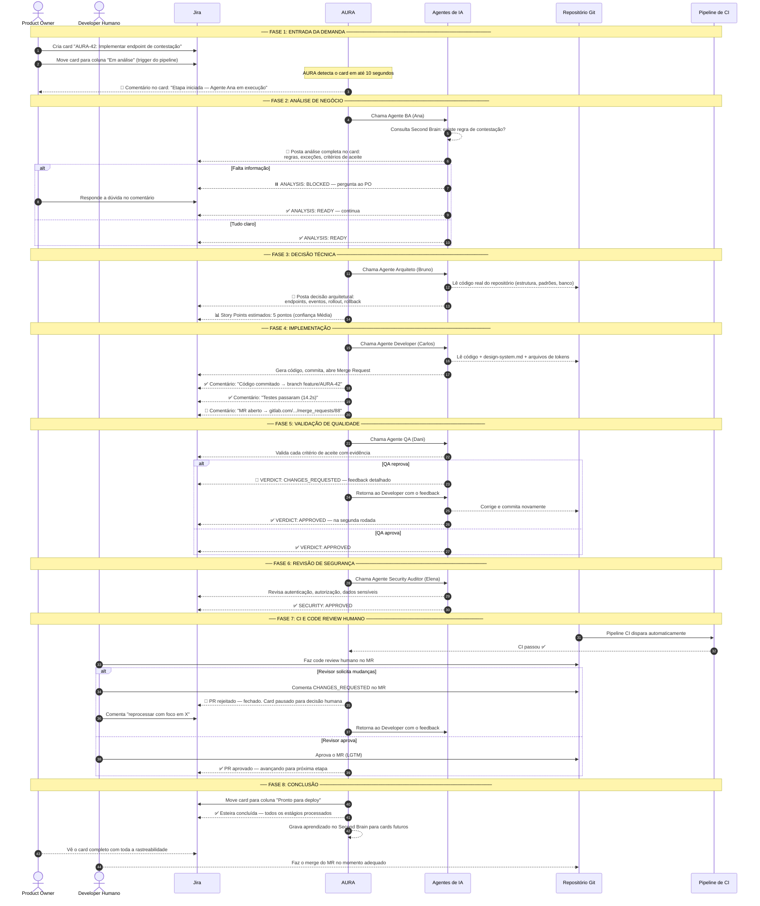

# Jornada da Demanda — AURA

> Perspectiva do usuário e do negócio: o que acontece, quem participa e qual valor é entregue em cada etapa.

---

## Resumo da jornada

| Fase | Responsável | O que é entregue |
|---|---|---|
| 1 — Entrada | Product Owner | Card com descrição e critérios |
| 2 — Análise | Agente BA + (PO se bloqueado) | Regras, fluxos, critérios verificáveis |
| 3 — Arquitetura | Agente Arquiteto | Decisão técnica + estimativa de story points |
| 4 — Implementação | Agente Developer | Código commitado + testes passando + PR aberto |
| 5 — Qualidade | Agente QA | Validação contra todos os critérios de aceite |
| 6 — Segurança | Agente Security | Revisão de vulnerabilidades |
| 7 — Review | CI + Developer Humano | Aprovação técnica final |
| 8 — Conclusão | AURA | Card movido, conhecimento gravado no Second Brain |
