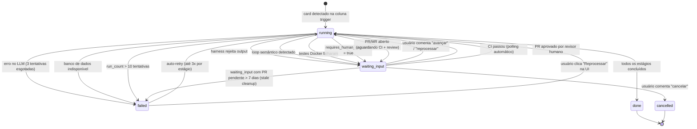
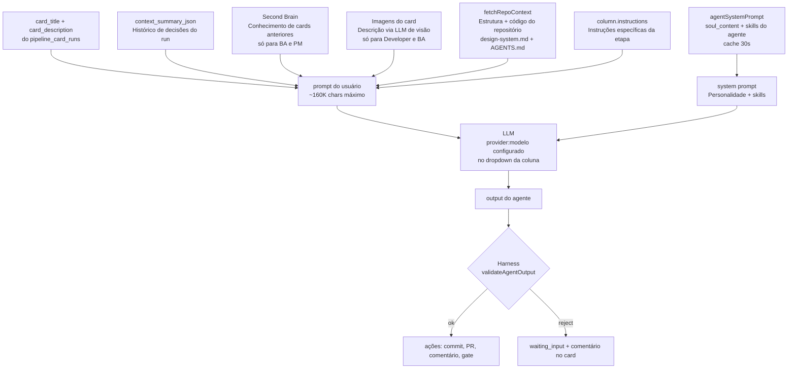

# Diagrama Técnico de Sequência — AURA

> Perspectiva de sistema: quais funções são chamadas, quais APIs são acionadas e como os dados fluem internamente.

```mermaid
sequenceDiagram
    autonumber

    participant Sched as scheduler.ts<br/>(tick 10s)
    participant Engine as pipeline-engine.ts<br/>tickPipelineEngine()
    participant Jira as work-pipeline-jira.ts
    participant DB as MySQL 8<br/>(pipeline_card_runs)
    participant Start as startColumn()
    participant Context as fetchRepoContext()<br/>+ loadAgentSkills()
    participant SB as second-brain-client.ts
    participant LLM as callAgentLLM()<br/>(provider configurado)
    participant Harness as agent-harness.ts
    participant Git as API Git<br/>(GitLab/GitHub)
    participant Sandbox as sandbox-runner.ts<br/>(Docker)
    participant Bus as event-bus.ts<br/>(SSE)

    Note over Sched, Bus: ── TICK DO SCHEDULER ────────────────────────────────────────────────────

    Sched->>Engine: tickPipelineEngine()
    Engine->>DB: UPDATE status='failed' WHERE status='running' AND updated_at < now-2h
    Engine->>DB: UPDATE status='failed' WHERE status='waiting_input' AND pr pendente > 7d

    Note over Sched, Bus: ── DESCOBERTA DE NOVOS CARDS ────────────────────────────────────────────

    Engine->>Jira: fetchJiraIssuesByStatus(coluna_trigger)<br/>AbortSignal.timeout(15_000)
    Jira-->>Engine: [{ externalId, title, description, url }]

    loop Para cada card encontrado
        Engine->>DB: SELECT id, status WHERE card_key = ?
        alt Já existe run ativo
            Engine-->>Engine: skip (card já em processamento)
        else Novo card
            Engine->>DB: INSERT pipeline_card_runs (status='running')
            Engine->>Start: startColumn(run, triggerColumn)
        end
    end

    Note over Sched, Bus: ── startColumn() — PROCESSAMENTO DE UMA ETAPA ──────────────────────────

    Start->>DB: INSERT stage_snapshots_json (para rollback futuro)

    Note over Start: Para cada agente configurado na coluna...

    par Preparação do contexto
        Start->>Context: fetchRepoContext(repoId)<br/>Promise.race com timeout 5min
        Context->>Git: GET /repository/tree?recursive=true
        Git-->>Context: árvore de arquivos
        Context->>Git: GET /repository/files/design-system.md/raw
        Context->>Git: GET /repository/files/src/services/ContestacaoService.ts/raw
        Git-->>Context: conteúdo dos arquivos (até 160K chars total)
        Context-->>Start: string com contexto do repositório

    and Skills do agente
        Start->>Context: loadAgentSkills(workspaceId)<br/>cache TTL 30s
        Context-->>Start: conteúdo dos SKILL.md concatenados

    and Second Brain (só BA/PM)
        Start->>SB: searchKnowledge(titulo+descricao, dominio, top=5)
        SB-->>Start: entradas relevantes de cards anteriores
    end

    Note over Start: Monta prompt completo:
    Note over Start: context_summary + Second Brain + imagens + repo + skills

    Start->>LLM: callAgentLLM(agent, prompt, cfg, assignmentModel)
    Note over LLM: resolveProviderAndModel()<br/>provider e modelo do dropdown da coluna
    LLM->>LLM: dispatchLLM() → Anthropic / OpenAI / Gemini / Ollama
    LLM-->>Start: { text, inputTokens, outputTokens, costUsd, model }

    Note over Sched, Bus: ── VALIDAÇÃO DO OUTPUT (HARNESS) ───────────────────────────────────────

    Start->>Harness: validateAgentOutput(text, { agentRole, cardKey })
    alt Output inválido (secret detectado, gate ausente, resposta vazia)
        Harness-->>Start: { ok: false, reason: "..." }
        Start->>Jira: postJiraComment(rejectionMsg)<br/>AbortSignal.timeout(15_000)
        Start->>DB: UPDATE status='waiting_input'
        Start->>DB: INSERT pipeline_quality_metrics (gate_rejected)
    else Output válido
        Harness-->>Start: { ok: true }
        Start->>DB: INSERT pipeline_quality_metrics (gate_passed)
    end

    Note over Sched, Bus: ── DETECÇÃO DE LOOP SEMÂNTICO ─────────────────────────────────────────

    Start->>DB: SELECT COUNT(*) mensagens similares na mesma etapa
    alt Mesma etapa ≥ 3 vezes com output similar
        Start->>Jira: postJiraComment("🔄 Loop detectado")
        Start->>DB: UPDATE status='waiting_input'
        Start->>Bus: broadcast('pipeline.loop_detected', ...)
    end

    Note over Sched, Bus: ── ACÚMULO DE CONTEXTO ────────────────────────────────────────────────

    Start->>DB: UPDATE context_summary_json<br/>(stage, agent, gate, decision)
    Start->>Bus: broadcast('pipeline.agent_output',<br/>{ agent, tokens_in, tokens_out, model, output_preview })

    Note over Sched, Bus: ── SANDBOX DOCKER (se TEST_CMD presente no output) ─────────────────────

    alt Output contém "TEST_CMD: pnpm test --run"
        Start->>Sandbox: runSandboxTests(agentOutput, repoId)
        Sandbox->>Git: git clone --depth 1 → /tmp/aura-sandbox-XXXXX
        Sandbox->>Sandbox: docker run --rm --network none<br/>--read-only --pids-limit 256<br/>--memory 512m --cpus 1<br/>node:22-alpine sh -c "pnpm test --run"
        alt Testes passaram
            Sandbox-->>Start: { passed: true, message: "✅ 14.2s" }
            Start->>Jira: postJiraComment("✅ Testes passaram")
        else Testes falharam
            Sandbox-->>Start: { passed: false, message: "❌ 3 failures" }
            Start->>Jira: postJiraComment("❌ Testes falharam — PR não aberto")
            Start->>DB: UPDATE status='waiting_input'
            Note over Start: Para aqui. Humano decide reprocessar.
        end
        Sandbox->>Sandbox: cleanup /tmp/aura-sandbox-XXXXX
    end

    Note over Sched, Bus: ── COMMIT DE CÓDIGO (se ### FILE: presente no output) ─────────────────

    alt Output contém blocos "### FILE: caminho/arquivo.ts"
        Start->>Git: POST /repository/commits<br/>(branch: feature/AURA-42, files: [...])
        Git-->>Start: { ok: true, branch, files, message }
        Start->>Jira: postJiraComment("✅ Código commitado → branch feature/AURA-42")
        Start->>DB: INSERT pipeline_card_messages (agent_to_card)
    end

    Note over Sched, Bus: ── ABERTURA DE PR/MR (se OPEN_PR: true presente) ──────────────────────

    alt Output contém "OPEN_PR: true"
        Start->>Git: POST /merge_requests (GitLab)<br/>ou POST /pulls (GitHub)
        Git-->>Start: { ok: true, prNumber: 88, url: "..." }
        Start->>Jira: postJiraComment("✅ MR aberto → gitlab.com/.../88")

        alt Repositório é GitHub
            Start->>DB: UPDATE pr_check_json<br/>{ owner, repo, prNumber, ci_fix_count: 0 }
            Note over Start: CI polling ativado para próximo tick
        end

        Start->>DB: UPDATE pr_review_json<br/>{ repoId, prNumber, prUrl, checkedAt: 0 }
        Note over Start: Review polling ativado para próximo tick
    end

    Note over Sched, Bus: ── ESTIMATIVA DE STORY POINTS (só após Arquiteto) ──────────────────────

    alt Agente é software architect
        Start-->>LLM: generateEstimate() — chamada não-bloqueante (.catch absorve)
        LLM-->>Jira: 📊 "Story Points: 5 | Confiança: Média"
        LLM-->>DB: INSERT pipeline_quality_metrics (story_points_estimate)
    end

    Note over Sched, Bus: ── AVANÇO PARA PRÓXIMA ETAPA ──────────────────────────────────────────

    Start->>DB: UPDATE context_summary_json (acumula decisão)
    Start->>DB: UPDATE stage_snapshots_json (snapshot antes da próxima etapa)

    alt Próxima coluna tem requires_human_approval = true
        Start->>Jira: postJiraComment("⏸️ Aprovação necessária — Code Review")
        Start->>DB: UPDATE status='waiting_input'
        Note over Start: Aguarda comentário "avançar" no Jira
    else Avança automaticamente
        Start->>Jira: transitionJiraIssue(nextColumn.name)<br/>AbortSignal.timeout(15_000)
        Start->>Bus: broadcast('pipeline.stage_started', ...)
        Start->>Start: startColumn(run, nextColumn) ← recursivo
    end

    Note over Sched, Bus: ── POLLING DE CI (próximo tick, se pr_check_json preenchido) ───────────

    Engine->>Engine: checkAndAdvancePRCI(run)
    Engine->>Git: GET /repos/{owner}/{repo}/pulls/{n}<br/>AbortSignal.timeout(15_000)
    Engine->>Git: GET /commits/{sha}/check-runs
    alt Checks pendentes
        Engine-->>Engine: return (retry no próximo tick)
    else CI passou
        Engine->>DB: UPDATE pr_check_json = NULL
        Engine->>Jira: postJiraComment("✅ CI passou — avançando")
        Engine->>Start: advanceToNextColumn()
    else CI falhou (até 3 tentativas)
        Engine->>Git: GET /actions/jobs/{id}/logs (últimos 2KB)
        Engine->>LLM: Developer corrige o erro com log real
        Engine->>Git: push correção na branch
        Engine->>DB: UPDATE pr_check_json (ci_fix_count++)
    end

    Note over Sched, Bus: ── CONCLUSÃO DO RUN ───────────────────────────────────────────────────

    Start->>DB: UPDATE status='done'
    Start->>Jira: postJiraComment("✅ Esteira concluída", runId)<br/>runId passado para tratar card deletado
    Start->>Bus: broadcast('pipeline.run_completed', ...)
    Start->>SB: addKnowledge({ card_key, title, description, domain })
    Start->>DB: INSERT pipeline_quality_metrics (stage_duration_sec)
```

---

## Estados possíveis de um run

---

## Fluxo de dados do prompt (o que o LLM recebe)

